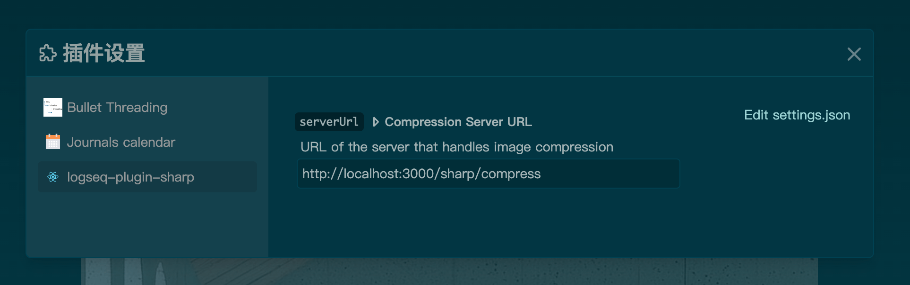
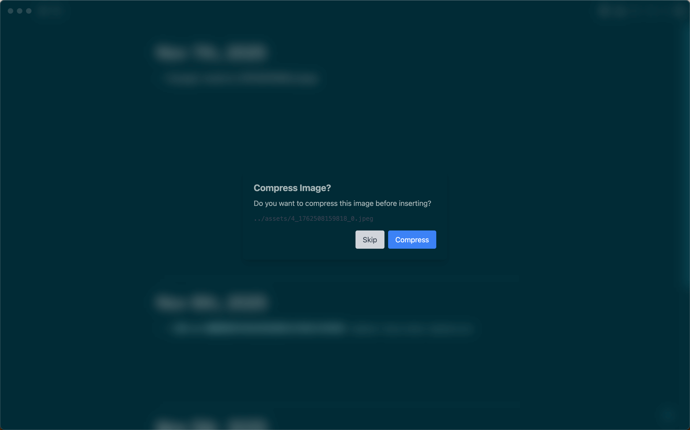
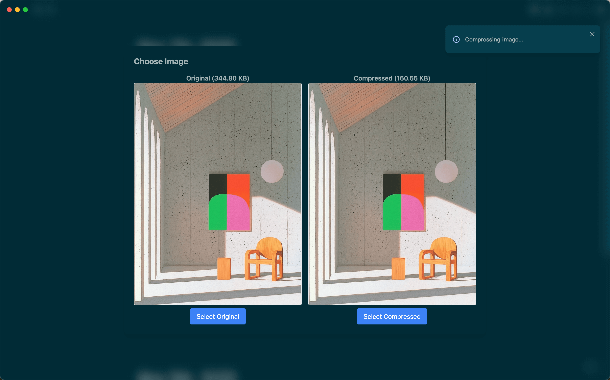
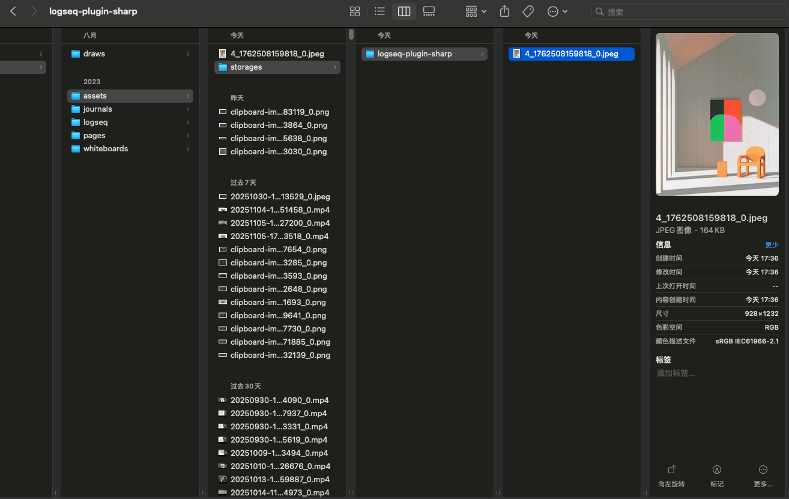

# Logseq Image Compression Plugin

## Plugin Overview

This plugin intercepts images that are pasted or dragged into Logseq, uploads the original file to a custom compression service, and shows a comparison dialog once the compressed result is returned so you can choose between the original and the compressed copy. It will:

- Automatically detect newly added image Markdown inside a block.
- Call the configured compression server (`multipart/form-data` field name `image`).
- Display the size and preview comparison between the original and compressed images, then update the block after you confirm your choice.

> The default companion compression backend is [scarletsky/sharp-server](https://github.com/scarletsky/sharp-server), but you can switch to any service that exposes the same API in the settings.

## Screenshots

## Current Limitations and Assets Directory Status

With the current Logseq plugin API, we cannot intercept the workflow before the host app writes the original image into `assets/`, nor can we override the default paste/drag behavior. We tried the following approaches in practice:

1. **Host filesystem bridge**: In theory we could overwrite the original file in `assets/` on desktop via `window.parent.require('fs')`, but this plugin runs inside Logseq's iframe sandbox, which is isolated from the host context, so `fs` cannot be accessed and the idea is not viable in real environments.
2. **Sandbox storage fallback**: We use `logseq.Assets.makeSandboxStorage()` to write into the plugin's private directory `assets/storages/<plugin-id>/`, ensuring the plugin works across environments.

Because Logseq does not emit an interceptable event before writing the file, the default workflow remains: the original image is written to `assets/` first, and the compressed version is stored in `assets/storages/<plugin-id>/` afterward.
As a result, two copies of each image coexist, the `assets/` directory does not shrink, and it may even grow because the original is still present.
Please keep this in mind and manually clean up or replace the original files (or rely on a filesystem bridge) after compression if necessary. Should Logseq expose insertion hooks or write APIs in the future, we will update the plugin to allow true overwrites of the originals.
